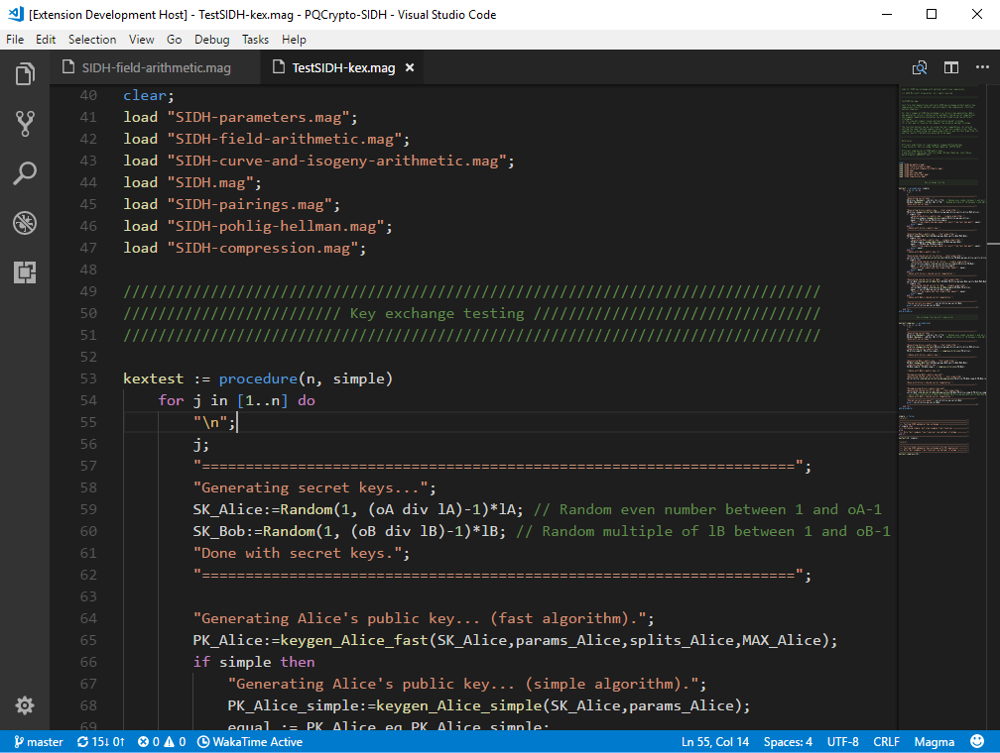

# Magma for Visual Studio Code

This extension adds language support for the [Magma computational algebra system](http://magma.maths.usyd.edu.au/) to Visual Studio Code. Its main features can be seen below.

Read the [`CHANGELOG`](CHANGELOG.md) to know what has changed over the last version of this extension.

## Main Features

- Syntax highlighting
- Snippets

### IDE Features

## Installation

### Visual Studio Code

To install the extension from Visual Studio Code, hit `F1` and enter the `ext install magma` command, or use the extension panel and search for `magma`.

### Installing Locally

In order to install the extension locally, clone the [GitHub repository](https://github.com/etairi/vscode-magma) under your local extensions folder:

* Windows: `%USERPROFILE%\.vscode\extensions`
* Mac / Linux: `$HOME/.vscode/extensions`

## License

**VSCODE-MAGMA** is licensed under the MIT License; see [`LICENSE`](LICENSE) for details.

## Contributing

This project has adopted the [Contributor Covenant Code of Conduct](https://www.contributor-covenant.org/),
with the following additional clauses:

* We respect the rights to privacy and anonymity for contributors and people in
  the community. If someone wishes to contribute under a pseudonym different to
  their primary identity, that wish is to be respected by all contributors. 

If you have questions or comments, please feel free to email the author. For feature requests, suggestions, and bug reports, please [open an issue on this Github repository](https://github.com/etairi/vscode-magma/issues) (or, send an email to the author). Patches are also welcomed as [pull requests on this GitHub repository](https://github.com/etairi/vscode-magma/pulls), as well as by
email.
